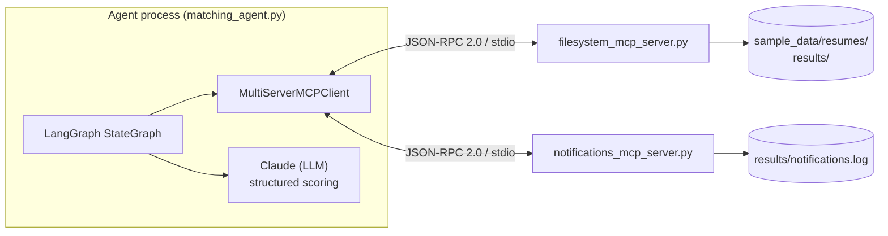
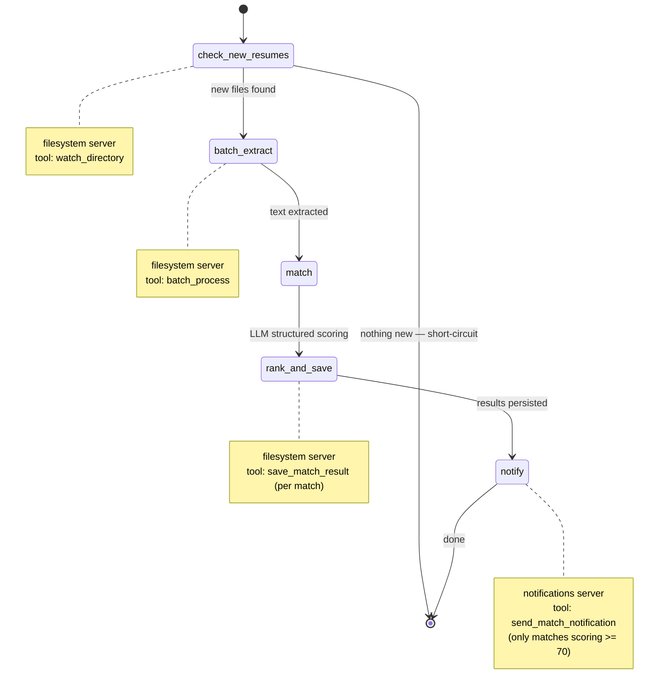

# Resume Matcher — MCP Edition

Resume-matching agent's direct
filesystem tools, replaced with a standalone MCP server, plus a
LangGraph agent refactored to speak to it (and a second MCP server)
through a real MCP client instead of local function calls.

## Learning objectives → what's in this repo

| Objective | Where |
|---|---|
| Understand Model Context Protocol | `filesystem_mcp_server.py` implements tools *and* resources; tested against the real JSON-RPC 2.0 wire protocol in `tests/` (not mocked) |
| Replace custom tools with MCP servers | Every Milestone 1 filesystem operation is now an `@mcp.tool()`; nothing in `matching_agent.py` imports filesystem code directly |
| Implement standardized tool interfaces | Consistent `{"success": bool, ...}` envelope on every tool; structured JSON-RPC-style error codes (see below) |
| Deploy production-ready systems | Env-based config, bounded concurrency, partial-failure handling, a tested env-forwarding fix, 14 passing tests across unit + protocol layers |

## Architecture



Two independent MCP servers, each a separate OS process, each with no
knowledge of the other or of LangGraph. The agent discovers their tools
at startup (`client.get_tools()`) and calls them by name — that's the
whole point of the refactor: `filesystem_mcp_server.py` could gain a
new tool tomorrow and `matching_agent.py` wouldn't need a code change.

## State machine (agent ↔ MCP interaction)



`check_new_resumes` calling `watch_directory` first — before touching
anything else — is deliberate: a run with nothing new short-circuits
straight to `[*]` without spending an LLM call, and `--watch` mode (see
below) reprocesses only what actually changed instead of the whole
directory every time.

## Run locally

From the repo root, create the virtual environment and install dependencies.

### Bash / Git Bash / Linux / macOS

```bash
cd /path/to/mcp_agentic_architecture/files
python3 -m venv .venv
source .venv/bin/activate
python -m pip install -r requirements.txt
export ANTHROPIC_API_KEY="<your-anthropic-api-key>"
python matching_agent.py
```

### Windows PowerShell

```powershell
cd C:\Airtribe Projects\mcp_agentic_architecture\files
python -m venv .venv
.\.venv\Scripts\Activate.ps1
python -m pip install -r requirements.txt
$env:ANTHROPIC_API_KEY = "<your-anthropic-api-key>"
python .\matching_agent.py
```

### If you want to rescan the inbox from scratch

The watcher keeps a small state file so it only scores newly-added resumes. If you want to process the current folder again, clear watcher state first:

```bash
python matching_agent.py --reset-watch
```

### Common usage patterns

```bash
# one pass over the bundled sample data
python matching_agent.py

# run against your own job description and resume folder
python matching_agent.py --job-description path/to/jd.txt --resume-dir path/to/resumes

# keep polling for newly added resumes every 15s (Ctrl+C to stop)
python matching_agent.py --watch --interval 15
```

> Use the project venv's Python, not the system Python, when running the agent. In this repo, the working command is typically `./.venv/Scripts/python.exe matching_agent.py` on Windows or `source .venv/bin/activate && python matching_agent.py` on Unix-like shells.

Run either server standalone to poke at it directly (handy with the
[MCP Inspector](https://modelcontextprotocol.io/docs/tools/inspector)):

```bash
python filesystem_mcp_server.py
python notifications_mcp_server.py
```

Config is env-driven — see `ServerConfig.from_env()` in
`filesystem_mcp_server.py`:

| Variable | Default |
|---|---|
| `RESUME_DIRECTORY` | `./sample_data/resumes` |
| `RESULTS_DIRECTORY` | `./results` |
| `ALLOWED_EXTENSIONS` | `.txt,.pdf,.docx` |
| `MAX_BATCH_CONCURRENCY` | `5` |
| `NOTIFY_SCORE_THRESHOLD` | `70` (matching_agent.py) |
| `MATCHING_AGENT_MODEL` | `anthropic:claude-sonnet-5` |

## Testing

```bash
pytest tests/ -v
```

14 tests, two layers:
- **Unit** (`test_filesystem_mcp_server.py`, most of it): call tool
  functions directly against a `tmp_path` fixture — fast, no
  subprocess. Covers success paths, the `RESUME_NOT_FOUND` /
  `INVALID_PARAMS` error codes, and `batch_process`'s partial-failure
  reporting.
- **Protocol** (`test_server_speaks_mcp_protocol_over_stdio`): launches
  the real server as a subprocess and drives it with the official
  `mcp` client SDK — `tools/list`, `tools/call`, `resources/read` —
  over actual JSON-RPC 2.0, so it's proving the protocol layer, not
  just the Python underneath it.
- **Agent** (`test_matching_agent.py`): the LLM call is swapped for a
  deterministic fake (`FakeStructuredModel`) so these need no API key —
  they're checking the graph wiring, multi-server tool discovery, the
  short-circuit-on-no-new-files path, and that a second `--watch`-style
  pass only reprocesses the newly arrived file, not the whole
  directory.

## Design decisions

**MCP SDK pinned to `mcp>=1.28,<2.0`.** The Python SDK's v2 line
shipped alongside the 2026-07-28 MCP spec revision and renames
`FastMCP` to `MCPServer` (now under `mcp.server.mcpserver`). v1.x is
what the current LangChain/LangGraph MCP ecosystem is built and
documented against, so this project pins to it on purpose rather than
by accident — worth revisiting once `langchain-mcp-adapters` and the
wider tutorial base catch up to v2.

**stdio over HTTP.** No network surface to secure, no auth to wire up,
and it's what `MultiServerMCPClient` expects for a local "command"
server. The tradeoff, confirmed while building this: each tool call
opens a fresh subprocess session rather than reusing one — fine for a
demo/CLI agent, and the honest reason a latency-sensitive production
version would move to a long-lived `streamable-http` server instead.

**Errors are structured JSON, not prose.** Every failure raises
`ToolError` with a JSON payload carrying a `code` in the JSON-RPC
"server error" range (`-32000`..`-32099`) plus a machine-readable
`error` label (`RESUME_NOT_FOUND`, `DIRECTORY_NOT_FOUND`,
`UNSUPPORTED_FILE_TYPE`, `EXTRACTION_FAILED`, `INVALID_PARAMS`).
Confirmed end-to-end against a live client session: it surfaces as
`CallToolResult(isError=True, ...)`, and `matching_agent.py`'s
`_call_tool()` re-raises it as `MCPToolCallError` with the code intact
instead of a caller having to string-match a message.

**`watch_directory` polls; it doesn't push.** MCP tools are
request/response, so this is a poll (a JSON state file of
filename→mtime, diffed on each call) rather than an inotify/watchdog
listener. `matching_agent.py`'s `--watch` mode is what turns that into
something that feels live — a background listener pushing through MCP
resource *subscriptions* would be the natural next step and is
supported by the protocol, just out of scope here.

**`batch_process` takes an explicit file list, not just a directory.**
This is what lets `check_new_resumes → batch_extract` reprocess only
what `watch_directory` just reported instead of the whole folder every
time — the concurrency (`asyncio.Semaphore(MAX_BATCH_CONCURRENCY)`) is
what makes "efficient" in the spec actually true when that list is
long.

**Env forwarding is explicit, and it's not a default you can skip.**
Real gotcha hit while building this: `mcp`'s stdio client does *not*
inherit the parent process's environment — it starts child servers
with a minimal default (`PATH`/`HOME`/`TERM` only), confirmed directly
against `mcp.client.stdio.get_default_environment()`. Without passing
`env=dict(os.environ)` explicitly in `matching_agent.py`'s server
config, `RESUME_DIRECTORY` and friends silently never reach
`filesystem_mcp_server.py` — the agent runs, discovers tools fine, and
just quietly operates on the wrong directory. Worth knowing before it
costs you a debugging session.

## Repo structure

```
resume-matcher-mcp/
├── filesystem_mcp_server.py      # Part A
├── notifications_mcp_server.py   # Part B bonus: 2nd MCP server
├── matching_agent.py             # Part B
├── requirements.txt
├── pytest.ini
├── tests/
│   ├── test_filesystem_mcp_server.py
│   └── test_matching_agent.py
├── sample_data/
│   ├── job_description.txt
│   └── resumes/                  # 21 resumes, deliberately strong/partial/weak fit
└── results/                      # match_results.jsonl + notifications.log (gitignored)